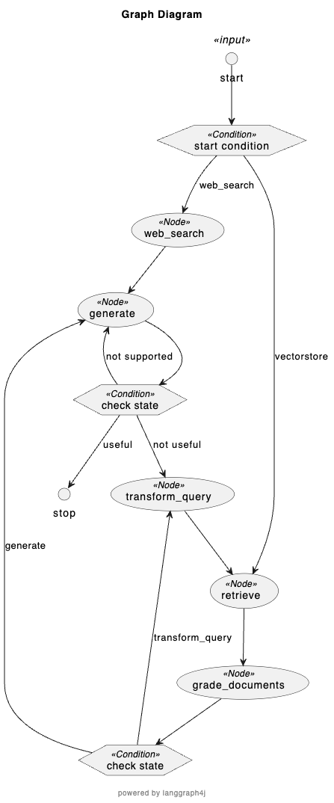

# Langgraph4j - Adaptive RAG

Java implementation of [Adaptive Rag]

[Adaptive Rag]:https://github.com/langchain-ai/langgraph/blob/main/examples/rag/langgraph_adaptive_rag.ipynb

## Mermaid diagram

```mermaid
---
title: Adaptive RAG
---
flowchart TD
	start((start))
	stop((stop))
	web_search("web_search")
	retrieve("retrieve")
	grade_documents("grade_documents")
	generate("generate")
	transform_query("transform_query")
	condition1{"check state"}
	condition2{"check state"}
	startcondition{"check state"}
	start --> startcondition
	startcondition -->|web_search| web_search
	startcondition -->|vectorstore| retrieve
	web_search --> generate
	retrieve --> grade_documents
	grade_documents --> condition1
	condition1 -->|transform_query| transform_query
	condition1 -->|generate| generate
	transform_query --> retrieve
	generate --> condition2
	condition2 -->|not supported| generate
	condition2 -->|not useful| transform_query
	condition2 -->|useful| stop
```

## PlantUML diagram


## Getting Started

### Populate Chroma Vector store using Docker

1. go to project root (i.e. _cloned project root_)
2. set environment variable `OPENAI_API_KEY`
3. run
   ```
   mvn -pl adaptive-rag exec:exec@upsert
   ```

### Run example

1. go to project root (i.e. _cloned project root_)
2. set environment variable `OPENAI_API_KEY`
3. set environment variable `TAVILY_API_KEY`
4. run
   ```
   mvn -pl adaptive-rag exec:exec@app
   ```

The main is [here](src/main/java/dev/langchain4j/adaptiverag/AdaptiveRag.java)

